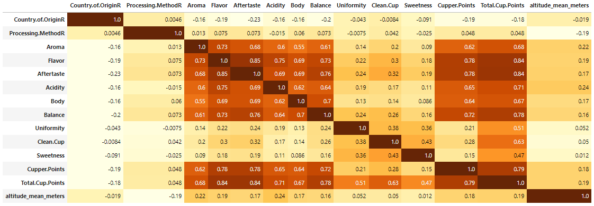
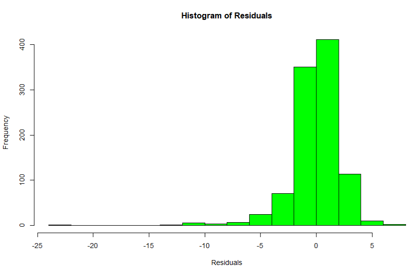
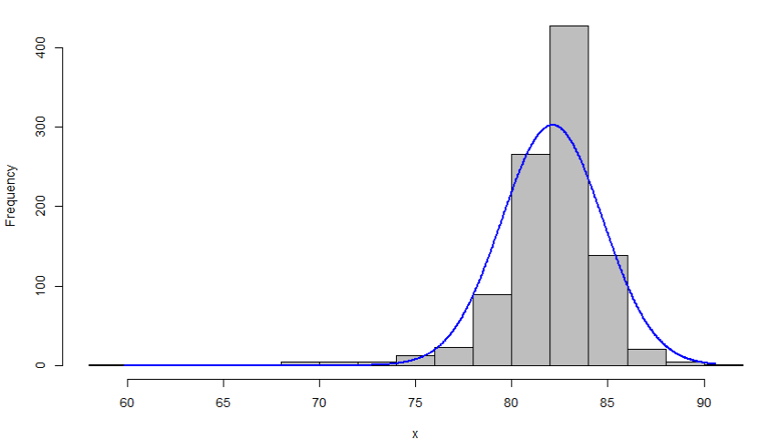

# Arabica-Coffee-Quality
# Brew-ston, We Have a Problem…I’m a Coffee Snob
[Final Presentation]( https://github.com/timcalhoun/Arabica-Coffee-Quality-Factors/tree/main/Presentation)

[Dataset]( https://github.com/jldbc/coffee-quality-database/blob/master/data/arabica_data_cleaned.csv)  

## Summary
* **998** total coffee bean samples **25 countries** 
* **82.69** average overall Q score per sample
* Our findings:
   * Mexico highest coffee bean sample amount submitted **225**

   * Washed/Wet most popular Processing Method **73%**

   * **5** countries (Mexico, Guatemala, Colombia, Brazil, Taiwan) that contribute to **68%** of total sample size

## Code and Resources Used 
**JupyterLab:** 3.3.3  
**Python within JupyterLab:** 3  
**Packages:** pandas, numpy, matplotlib, seaborn, sklearn  
**RStudio:** 2022.07.0  
**Packages:** dplyr, tidyr, rcompanion, car, ggplot2, tidyverse, mvnormtest, writexl  
**Articles:** 
   - [Two-way Anova] (https://www.statology.org/two-way-anova-r/)

## Data Wrangling
We initially looked at our basic column structures and what columns we wanted to keep.
Once we had the columns we wanted to work with, we removed the null values.

We then switched to looking at our columns data types to get a good understanding of what possible changes we may need to make for our statistical modeling. Here is the recoding we performed:

* Recoded the following Columns from strings to integers
    * Country.of.Origin
    * Processing.Method
* Created a new Column, Region, breaking the countries into 5 regions
    * Initially there were 4 regions; Africa, Central America, Asia and South America
    * The 4 regions were skewed since Mexico made Central America disproportionate, so Mexico became its own region
    * Also recoded Region from string to integer

For each of the variables above, they were categorical data. We changed them for this reason:
1. We wanted to run a Correlation Matrix 

   
* We created and exported the following for statistical modeling and visualization from Python to use in R:
    * 'Country.of.Origin', 'Country.of.OriginR', 'Region.Name', 'RegionR', 'Processing.Method', 'Processing.MethodR', 'Aroma', 'Flavor', 'Aftertaste', 'Acidity', 'Body', 'Balance', 'Uniformity', 'Clean.Cup', 'Sweetness', 'Cupper.Points', 'Total.Cup.Points', 'altitude_mean_meters'

## Data Exploration

1. Data Wrangling
   - We looked at Column Tables for: Country.of.Origin, Processing.Method, Region.Name

2. Circling back – as we started running statistical analysis, we were getting errors, ended up being countries with only 1 coffee bean sample
   - Removed all rows with 1 instance, which was only 7 rows

## Statistical Modeling
**Tasks:**

*1. Assumption Testing - Does Country.of.Origin & Processing.Method affect Total.Cup.Points
   - We passed the assumption of Normality, Sample Size and Independence
   - We ran 2-way ANOVA against Total.Cup.Points
      * Country.of.Origin & Country.of.Origin w/Processing.Method had significance
      * Processing.Method was not significant
    - We ran a histogram of residuals, normally distributed with a slight negative skew

   - We ran Levene’s Test, it violated the assumption of homogeneity of variance
      * When running a linear model to correct violation, we were unable to correct
  - Post Hocs – will not be moving on with these variables as a predictor of Total.Cup.Points
 
 * 2. Assumption Testing - Does Region.Name & Processing.Method affect Total.Cup.Points
    - We ran the same as above but for Region.Name
    * Ended up with the same results, our assumption was by grouping into Regions, you could possibly find more significance than individual countries – assumption was incorrect
  - Post Hocs – will not be moving on with these variables as a predictor of Total.Cup.Points

  * 3. Assumption Testing - Does Country.of.Origin affect Total.Cup.Points
    - We ran a histogram, normally distributed with a slight negative skew

   - We passed the assumption of Normality, Sample Size and Independence
   - We ran an Bartlett Test & Fligner Test against Total.Cup.Points
      * Both tests violated assumption of homogeneity of variance
  - We ran Welch’s One-way Test to correct for violation
      * p value < .01 – there is significance between Total Cup Points and all Countries
  - We ran pairwise t-test and show there was significance between certain countries
     *There is significance between certain countries with the biggest difference between Colombia and Mexico.  This has to do with Mexico and Colombia have 2 of 3 largest sample sizes
  - Post Hocs - Since assumption of homogeneity of variance wasn't met, this shows little difference between total cup point means, but partially due to the sample of size of each individual coffee.  There could be enough difference to sway how you go about trying coffee in the future 

  * 4. Assumption Testing - Does Region.Name affect Total.Cup.Points
    - We ran a histogram, normally distributed with a slight negative skew
   - We passed the assumption of Normality, Sample Size and Independence
   - We ran an Bartlett Test & Fligner Test against Total.Cup.Points
      * Both tests violated assumption of homogeneity of variance
  - We ran Welch’s One-way Test to correct for violation
      * p value < .01 – there is significance between Total Cup Points and all Regions
  - We ran pairwise t-test and show there was significance between certain countries
    * There is significance between Africa - Asia, C America and S America; Asia - Mexico and S America; C America - S America, Mexico - S America
- Post Hocs - Since assumption of homogeneity of variance wasn't met, post hocs show little difference between total cup point means, but there could be enough of a difference to sway what region you prefer or want to purchase from
